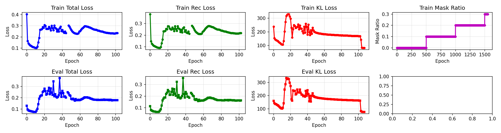
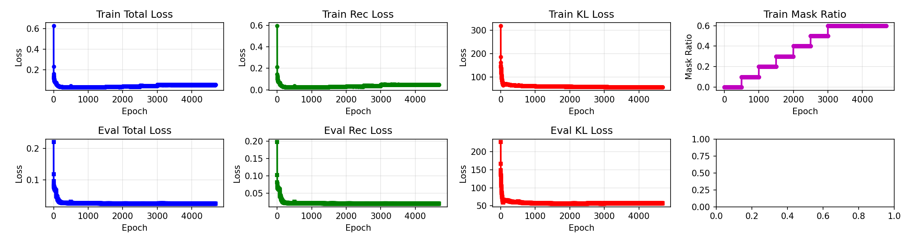
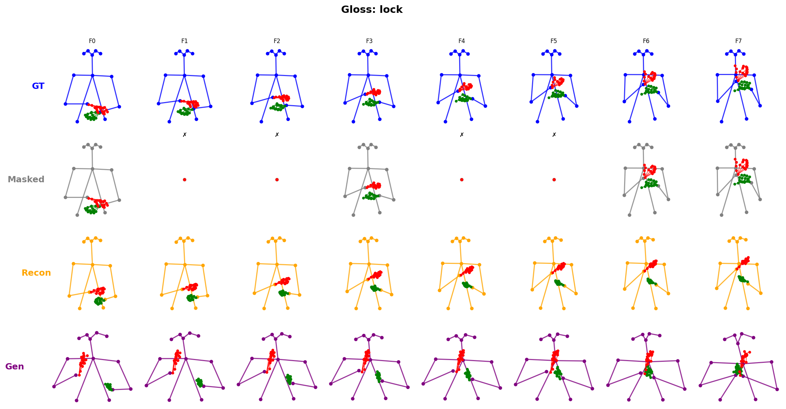

# Experiment Summary: ASL Motion Generation with Phonological Conditioning

## Research Objective

Develop a text-to-3D sign language motion generation system that replaces traditional CLIP conditioning with phonological attribute-based conditioning, using linguistic features as supervision signals for more accurate sign production.

---

## ASLLVD Skeleton Dataset

### Dataset Overview

- **Source**: ASL-Skeleton3D + ASL-Phono (derived from ASLLVD)
- **Scale**: ~9,000 JSON files, ~5-6 samples per gloss
- **Representation**: 3D skeleton coordinates (72 joints × 3 = 216 dimensions)
  - Upper body: 14 joints
  - Face (key landmarks): 16 joints
  - Hands: 21 joints × 2

### Frame Distribution Analysis

| Frames | Count | Percentage | Cumulative |
|--------|-------|------------|------------|
| 1      | 13    | 0.18%      | 0.18%      |
| 2      | 2,082 | 29.37%     | 29.56%     |
| 3      | 3,263 | 46.04%     | 75.59%     |
| 4      | 1,392 | 19.64%     | 95.23%     |
| 5      | 281   | 3.96%      | 99.20%     |
| 6      | 49    | 0.69%      | 99.89%     |
| 7      | 8     | 0.11%      | 100.00%    |

**Key Finding**: 75% of samples have only 2-3 frames (at 3 fps), representing merely 0.6-1 second of extremely sparse motion sampling.

### Training Attemp_1

**Architecture**: Transformer-based CVAE with curriculum learning

**Configuration**:
- Input dimension: 216 (72 joints × 3)
- Latent dimension: 256
- Model dimension: 512
- Attention heads: 8
- Layers: 4
- Sequence interpolation: Short sequences interpolated to minimum length

#### Result(Attemp_1): Loss became NaN at ~100 epochs (without gradient clipping)


*Figure 1: Training loss curve showing divergence around epoch 100.*
---


### Training Attemp_2
1. Clamp `logvar` in `aslAvatarModel.py`

Find where the encoder outputs `mu` and `logvar`, and add:

```python
logvar = torch.clamp(logvar, min=-20, max=20)
```

2. Add gradient clipping in `train_v1.py`

In the training loop, after `backward()` and before `optimizer.step()`, add:

```python
self.accelerator.backward(loss)
torch.nn.utils.clip_grad_norm_(self.model.parameters(), max_norm=1.0)  # Add this line
self.optimizer.step()
```


#### Result(Attemp_2): 


*Figure 2: Training loss curve.*


*Figure 3: Result examples.*


*Figure 4: Result examples.*


---

## ASL SignBank 

### Keyframe Distribution Analysis

Total gloss folders: 3,186

|Frames| Cnt | Ratio |     |Frames| Cnt | Ratio |     |Frames| Cnt | Ratio |     |Frames| Cnt | Ratio |
|----|-----|-------|-----|----|-----|-------|-----|----|-----|-------|-----|----|-----|-------|
| 8  | 1   | 0.03% |   | 28 | 181 | 5.68% |   | 43 | 32  | 1.00% |   | 58 | 3   | 0.09% |
| 13 | 2   | 0.06% |   | 29 | 178 | 5.59% |   | 44 | 18  | 0.57% |   | 59 | 7   | 0.22% |
| 15 | 5   | 0.16% |   | 30 | 199 | 6.25% |   | 45 | 26  | 0.82% |   | 60 | 4   | 0.13% |
| 16 | 15  | 0.47% |   | 31 | 186 | 5.84% |   | 46 | 23  | 0.72% |   | 61 | 1   | 0.03% |
| 17 | 21  | 0.66% |   | 32 | 130 | 4.08% |   | 47 | 20  | 0.63% |   | 62 | 3   | 0.09% |
| 18 | 50  | 1.57% |   | 33 | 99  | 3.11% |   | 48 | 16  | 0.50% |   | 63 | 5   | 0.16% |
| 19 | 71  | 2.23% |   | 34 | 79  | 2.48% |   | 49 | 19  | 0.60% |   | 64 | 2   | 0.06% |
| 20 | 100 | 3.14% |   | 35 | 70  | 2.20% |   | 50 | 12  | 0.38% |   | 66 | 2   | 0.06% |
| 21 | 135 | 4.24% |   | 36 | 76  | 2.39% |   | 51 | 14  | 0.44% |   | 67 | 1   | 0.03% |
| 22 | 156 | 4.90% |   | 37 | 46  | 1.44% |   | 52 | 14  | 0.44% |   | 68 | 2   | 0.06% |
| 23 | 213 | 6.69% |   | 38 | 46  | 1.44% |   | 53 | 7   | 0.22% |   | 70–77 | 6 | 0.19% |
| 24 | 183 | 5.74% |   | 39 | 35  | 1.10% |   | 54 | 7   | 0.22% |   | 85 | 1   | 0.03% |
| 25 | 204 | 6.40% |   | 40 | 30  | 0.94% |   | 55 | 9   | 0.28% |   | 116 | 1  | 0.03% |
| 26 | 192 | 6.03% |   | 41 | 31  | 0.97% |   | 56 | 7   | 0.22% |   |    |     |       |
| 27 | 155 | 4.87% |   | 42 | 27  | 0.85% |   | 57 | 8   | 0.25% |   |    |     |       |

**Key Finding**: Distribution peaks at 23 frames (6.69%), with ~75% of glosses containing 20–32 keyframes. Median is approximately 27 frames, indicating substantially denser temporal sampling compared to the skeleton dataset.

---
## WLASL Dataset 

**Source:** WLASL v0.3 JSON (2,000 glosses, ~21K annotated instances)  
**Videos downloaded via:** `yt-dlp` from YouTube (many links expired)

| Metric | Count |
|---|---|
| Total glosses in JSON | 2,000 |
| Videos found | 11,980 |
| Videos missing (expired links) | 9,103 |
| Download rate | ~56.8% |

### Per-Gloss Video Distribution

| Min Videos per Gloss | Qualifying Glosses | Total Videos |
|---:|---:|---:|
| ≥ 1 | 2,000 | 11,980 |
| ≥ 3 | 1,986 | 11,952 |
| ≥ 5 | 1,575 | 10,384 |
| ≥ 8 | 355 | 3,268 |
| ≥ 10 | 104 | 1,160 |
| ≥ 12 | 30 | 394 |
| ≥ 15 | 5 | 78 |
| ≥ 18 | 0 | 0 |
| ≥ 20 | 0 | 0 |

---

## SMPL-X Extraction

- **Tool**: [SMPLest-X](https://github.com/MotrixLab/SMPLest-X) — lightweight, efficient SMPL-X parameter extraction
- **Output**: Full SMPL-X parameters (body pose, hand pose, facial expression) per frame

---

## References

- ASL-Skeleton3D / ASL-Phono dataset
- ASL Signbank: https://aslsignbank.haskins.yale.edu/signs
- ASL-LEX 2.0: Phonological database
- SMPLer-X: https://github.com/caizhongang/SMPLer-X
